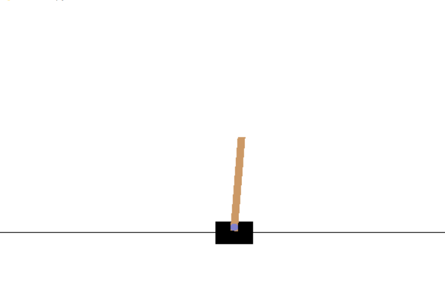

# CartPole-DQN-Pytorch
Implements of DQN with pytorch to play CartPole
## Dependency 
gym
numpy
pytorch
## CartPole
### CartPole-v0
A pole is attached by an un-actuated joint to a cart, which moves along a frictionless track. The system is controlled by applying a force of +1 or -1 to the cart. The pendulum starts upright, and the goal is to prevent it from falling over. A reward of +1 is provided for every timestep that the pole remains upright. The episode ends when the pole is more than 15 degrees from vertical, or the cart moves more than 2.4 units from the center.

CartPole-v0 defines "solving" as getting average reward of 195.0 over 100 consecutive trials.

This environment corresponds to the version of the cart-pole problem described by Barto, Sutton, and Anderson [Barto83].

### Example

### Local test
1. single action 0/1 : average reward around 9.5 
2. random action 0 or 1 : average reward around 19.0
3. solved : average reward around 195+

### Implements
500+ episode to reach 200.0 average reward
